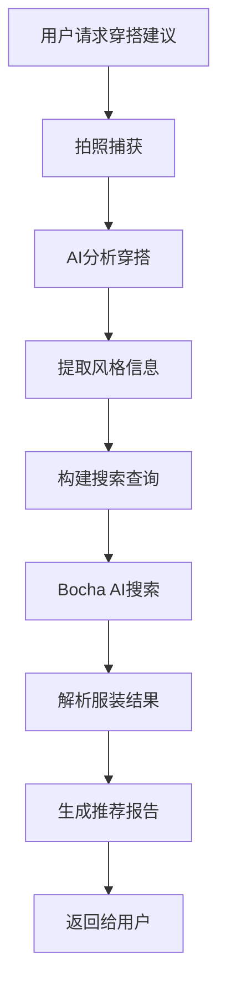

# 🎯 穿搭推荐系统改造完成总结

## 📋 项目概述

成功将现有的Bocha搜索功能改造为**专属个人衣服穿搭推荐系统**，实现了从拍照分析到服装推荐的完整流程。

## ✅ 完成的功能

### 🔧 核心模块

1. **OutfitAnalyzer** - 穿搭分析器
   - 📁 文件：`outfit_analyzer.h` / `outfit_analyzer.cc`
   - 🎯 功能：整合拍照和搜索，提供完整穿搭服务

2. **Enhanced BochaSearch** - 增强版搜索
   - 📁 文件：`bocha_search.h` / `bocha_search.cc`
   - ✨ 新增：专门的服装搜索工具
   - 🔍 优化：智能化服装查询构建

3. **Application Integration** - 应用集成
   - 📁 文件：`application.cc`
   - 🔗 功能：注册穿搭推荐MCP工具

## 🛠️ 新增MCP工具

### 1. 🔍 `self.outfit.analyze`
**功能**：拍照分析当前穿搭风格、颜色搭配和服装单品
- **参数**：无
- **返回**：详细的穿搭分析报告
- **使用场景**：用户想了解当前穿搭情况

### 2. 👔 `self.outfit.recommend`
**功能**：基于穿搭分析推荐配套衣物
- **参数**：`analysis_result`(可选)
- **返回**：推荐衣物列表和购买链接
- **使用场景**：寻找配套服装

### 3. 🎭 `self.outfit.complete_service`
**功能**：完整穿搭服务(分析+推荐)
- **参数**：无
- **返回**：完整的穿搭分析和推荐报告
- **使用场景**：最常用功能，一站式穿搭服务

### 4. 🛍️ `self.search.outfit`
**功能**：专门的服装搜索工具
- **参数**：
  - `style`: 服装风格(休闲/正式/运动/时尚)
  - `colors`: 颜色搭配
  - `season`: 适合季节
  - `item_type`: 服装类型
  - `count`: 结果数量(1-4)
- **返回**：增强的服装搜索结果

## 🔄 完整工作流程



## 🚀 技术特性

### 智能分析
- 🎨 **风格识别**：休闲、正式、运动、时尚等
- 🌈 **颜色分析**：自动提取主要颜色搭配
- 👕 **单品识别**：识别具体服装类型
- 🌍 **场合判断**：工作、社交、运动、日常

### 智能搜索
- 🔍 **查询优化**：自动添加购物相关关键词
- 💰 **价格提取**：自动识别价格信息
- 🏷️ **品牌识别**：检测知名品牌
- ⭐ **相关性评分**：智能计算推荐匹配度

### 个性化推荐
- 💡 **风格建议**：基于分析结果生成建议
- 🎯 **配套推荐**：推荐配套单品
- 🔄 **协调性建议**：确保颜色和风格协调

## 📝 使用示例

### 场景1：完整穿搭服务
```json
// 用户说："帮我看看今天的穿搭"
// AI调用：self.outfit.complete_service
{
  "success": true,
  "analysis": {
    "overall_style": "休闲",
    "color_scheme": "黑色+白色",
    "current_items": ["T恤", "牛仔裤", "运动鞋"],
    "season": "四季",
    "occasion": "日常"
  },
  "recommendations": {
    "style_advice": "整体搭配协调，可以考虑添加配饰",
    "recommended_items": [
      {
        "title": "休闲牛仔外套",
        "link": "https://example.com/jacket",
        "price": "¥299",
        "snippet": "经典休闲款，适合日常搭配"
      }
    ]
  }
}
```

### 场景2：特定搜索
```json
// 用户说："我想找正式的白色衬衫"
// AI调用：self.search.outfit
{
  "style": "正式",
  "colors": "白色", 
  "item_type": "衬衫",
  "count": 3
}
```

## 🔧 技术细节

### 编译集成
- ✅ 已添加到`CMakeLists.txt`
- ✅ 通过编译测试
- ✅ 正确注册MCP工具

### 错误处理
- ✅ 网络错误处理
- ✅ JSON解析错误处理
- ✅ 相机错误处理
- ✅ 搜索结果验证

### 内存管理
- ✅ 使用智能指针
- ✅ 正确的JSON内存释放
- ✅ 异常安全处理

## 🎯 改造成果

✅ **保持原有功能**：通用Bocha搜索功能完全保留  
✅ **增加专属功能**：新增4个专门的穿搭推荐工具  
✅ **智能化升级**：AI分析+智能搜索的完整链路  
✅ **用户体验优化**：一站式穿搭顾问服务  
✅ **技术架构完善**：模块化设计，易于维护和扩展  

## 🚀 未来扩展方向

1. **用户偏好学习**：记录用户喜好，提供更个性化推荐
2. **季节性推荐**：结合天气和季节信息
3. **预算控制**：支持价格区间筛选
4. **社交分享**：支持穿搭分享和评价
5. **AR试衣**：结合AR技术的虚拟试衣功能

---

🎉 **项目改造圆满完成！** 现在用户可以享受专业的AI穿搭顾问服务，从分析当前穿搭到推荐配套衣物，一应俱全！
